# Credit Card Customer Segmentation

Numerical behaviour · customer profiles · anomaly exploration

<strong>Project:</strong> Unsupervised Machine Learning Workshop 
<strong>Author:</strong> Gabriela Granja 
<strong>Repository:</strong> <a href="https://github.com/Bootcamp-IA-MAD-P7/unsupervised-ml-workshop">GitHub</a> 
<strong>Documentation:</strong> GitHub Pages

## Objective

This workshop uses unsupervised learning to explore behavioural patterns among
credit-card customers without predefined segment labels. Because there is no
ground-truth segmentation, model selection must combine internal clustering
metrics with cluster balance and interpretable profiles in the original
financial variables.

The resulting groups are segmentation hypotheses. They are not credit-risk
decisions, fraud labels or recommendations for automated customer treatment.

## Dataset

| Item | Executed notebook result |
|---|---:|
| Customers | 8,950 |
| Original columns | 18 |
| Behavioural variables after `CUST_ID` removal | 17 |
| Duplicate rows | 0 |
| Missing `CREDIT_LIMIT` values | 1 |
| Missing `MINIMUM_PAYMENTS` values | 313 |

The numerical variables summarise six months of balance, purchase,
cash-advance, payment, credit-limit, frequency and tenure behaviour. Their
ranges differ substantially, and several monetary distributions are strongly
right-skewed.

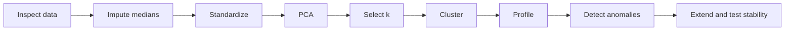

## Data quality and preparation

`CUST_ID` is retained only for tracing records and excluded from modelling. The
missing `CREDIT_LIMIT` and `MINIMUM_PAYMENTS` values are imputed with each
column's median, a robust choice for the skewed monetary variables. No missing
values remain after this step.

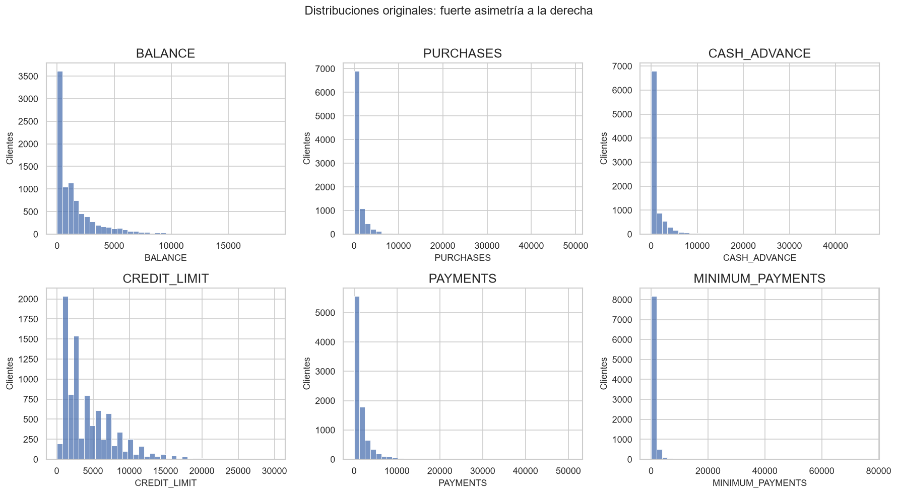

<strong>Figure 1.</strong> Six selected monetary and behavioural distributions from the executed baseline notebook.

The long right tails are visible rather than hidden: `MINIMUM_PAYMENTS`,
`PURCHASES`, `PAYMENTS` and `CASH_ADVANCE` record skewness of 13.85, 8.14, 5.91
and 5.17 respectively. This motivates median imputation and cautions against
interpreting raw means without context.

## Feature scaling

All 17 modelling variables are transformed with `StandardScaler`. This prevents
large monetary values from dominating Euclidean distances used by K-Means,
hierarchical clustering and PCA. The executed check confirms approximately zero
mean and unit standard deviation for every scaled feature.

## PCA

PCA first quantifies how much of the standardized feature space can be retained
in fewer dimensions.

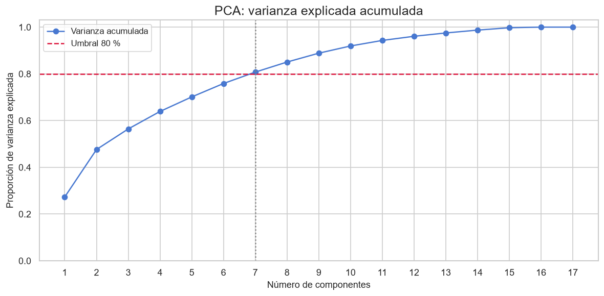

<strong>Figure 2.</strong> Cumulative explained variance across principal components; seven components retain 80.75%.

Seven components reach the selected 80% threshold, retaining **80.75%** of the
standardized variance. This is a compression result, not evidence of clusters.

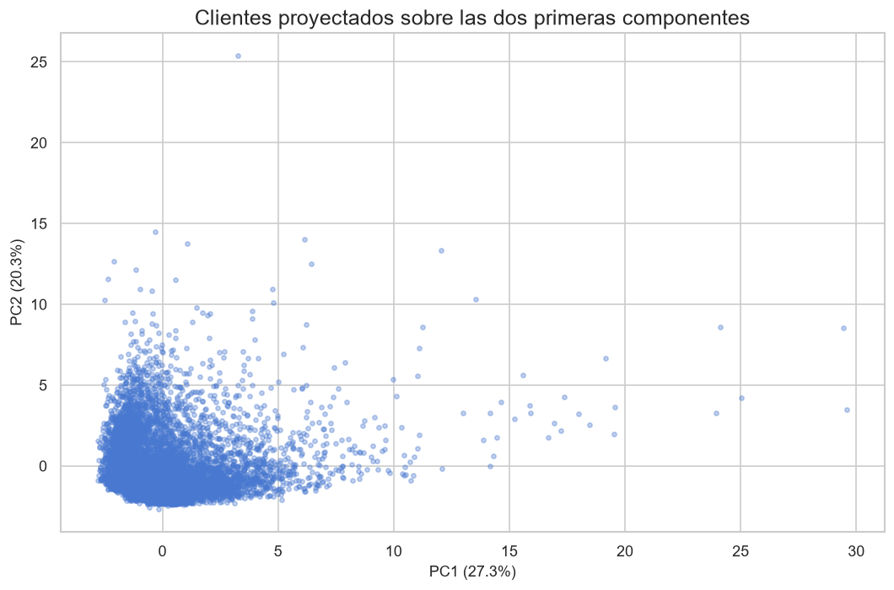

<strong>Figure 3.</strong> First two principal components, which together explain 47.61% of the standardized variance.

The two-dimensional view is useful for seeing the broad geometry but does not
represent all original information. The continuous cloud offers no obvious
visual ground truth, so clustering is evaluated in the complete standardized
feature space unless stated otherwise.

## K-Means model selection

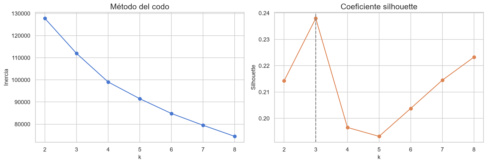

<strong>Figure 4.</strong> Inertia and sampled silhouette for k=2–8. The highest tested sampled silhouette selects k=3 at 0.238.

Inertia declines continuously, so the elbow alone is not decisive. The sampled
silhouette curve reaches its tested maximum at **k=3**, which is selected for
the baseline. The modest score signals overlapping behavioural structure rather
than sharply isolated groups.

## Final K-Means segmentation

| Cluster profile | Customers | Share |
|---|---:|---:|
| Low activity | 6,119 | 68.37% |
| Intensive purchasers | 1,235 | 13.80% |
| Cash-advance users | 1,596 | 17.83% |

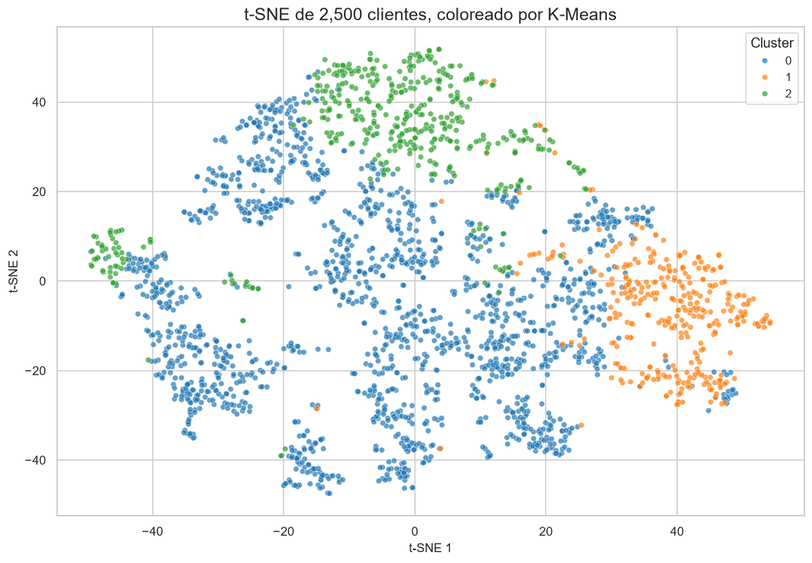

<strong>Figure 5.</strong> A stratified sample of the final K-Means labels shown in a t-SNE projection for visual inspection.

The projection shows structure and overlap but is not the fitting space. On the
common comparison sample, K-Means records silhouette **0.251**,
Calinski-Harabasz **526.01** and Davies-Bouldin **1.58**, the best combination
among the three exhaustive baseline algorithms tested.

## Customer profiles

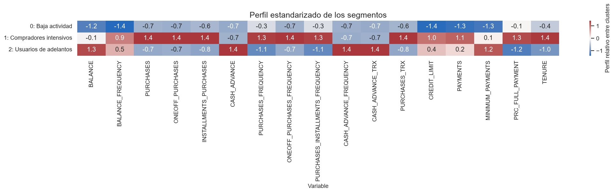

<strong>Figure 6.</strong> Segment means standardized relative to the full-dataset mean; the table below restores selected values to original units.

The executed profile table supports descriptive—not permanent—names:

| Segment | Evidence in the original variables | Practical interpretation |
|---|---|---|
| Low activity | Mean balance 799.75; purchases 505.53; cash advance 330.82 | Broad group with comparatively low account activity |
| Intensive purchasers | Purchases 4,268.52; purchase frequency 0.95; credit limit 7,733.97; payments 4,151.28 | Frequent, high-value purchase behaviour |
| Cash-advance users | Balance 3,989.14; cash advance 3,866.21; full-payment rate 0.03 | High balance and cash-advance use with low full-payment frequency |

These averages make the clusters interpretable, but operational use would
still require profitability, arrears and fairness evidence that the dataset
does not contain.

## Hierarchical clustering

Agglomerative clustering is inspected through a dendrogram built on a sample,
then evaluated with three clusters on the same comparison sample used for the
other exhaustive algorithms.

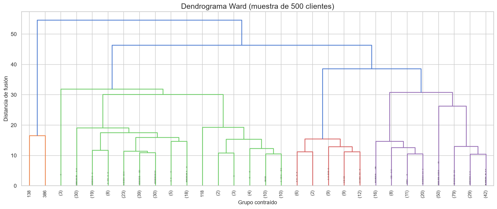

<strong>Figure 7.</strong> Ward-linkage dendrogram on a sample, used to inspect merging structure without rendering all 8,950 leaves.

Its silhouette is **0.17**, Calinski-Harabasz **401.83** and Davies-Bouldin
**1.81**. It provides a useful structural comparison but separates the tested
sample less clearly than baseline K-Means.

## DBSCAN

DBSCAN is applied to the PCA(2) projection as an exploratory density analysis,
not as the final customer segmentation.

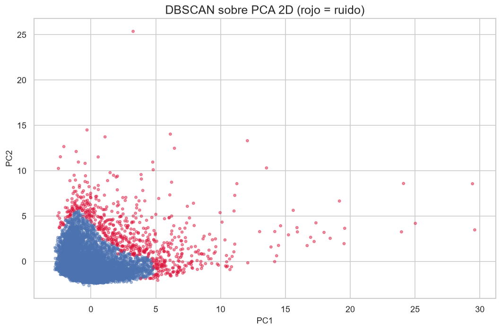

<strong>Figure 8.</strong> DBSCAN finds one main dense region and marks 681 customers as noise in PCA space.

The model identifies one cluster and **681 noise observations (7.6%)**. This
configuration does not yield a useful exhaustive segmentation; its noise label
means low density under the chosen representation and parameters, not fraud or
business anomaly.

## Algorithm comparison

| Algorithm | Clusters | Silhouette | Calinski-Harabasz | Davies-Bouldin | Notes |
|---|---:|---:|---:|---:|---|
| K-Means | 3 | 0.251 | 526.01 | 1.58 | Best baseline metric combination |
| Agglomerative | 3 | 0.17 | 401.83 | 1.81 | Similar exhaustive objective |
| Gaussian Mixture | 3 | 0.11 | 298.82 | 2.62 | Soft probabilistic model, evaluated as hard labels |
| DBSCAN on PCA(2) | 1 + noise | — | — | — | 681 noise points; not an exhaustive segmentation |

No single internal metric establishes business usefulness. The comparison
supports K-Means as the clearest baseline only when its stronger internal
metrics are considered together with the interpretable original-unit profiles.

## Anomaly detection

Isolation Forest ranks unusual combinations of all standardized behaviours.
The contamination value is explicitly set to **3%** as an analytical assumption;
it is not an estimate of fraud prevalence.

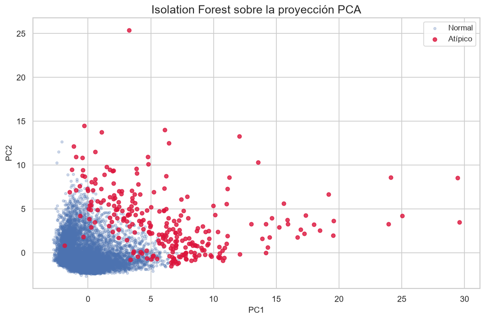

<strong>Figure 9.</strong> The model flags 269 observations for review and displays them on the PCA projection.

The flagged **269 customers** are candidates for contextual review. The model
does not establish fraud, error or customer value.

## Advanced extension

The advanced notebook adds four derived indicators—credit utilization, average
purchase per transaction, average cash advance per transaction and the
payment-to-minimum ratio—then compares three representations.

| Representation | Silhouette | Davies-Bouldin | ARI vs baseline | Largest cluster |
|---|---:|---:|---:|---:|
| Base | 0.251 | 1.585 | 1.000 | 68.369% |
| Base + KPIs | 0.175 | 1.796 | 0.392 | 54.749% |
| Base + KPIs + `log1p` | 0.210 | 1.768 | 0.136 | 35.374% |

Feature enrichment materially changes the segmentation. The KPI-plus-`log1p`
version is more balanced but agrees weakly with the baseline and does not
improve its silhouette; balance alone therefore does not make it a replacement.

Ten sub-sampling runs compare the advanced K-Means labels with the full-data
reference solution. Their mean ARI is **0.933 ± 0.107**, evidence of strong but
not perfect stability under this resampling procedure.

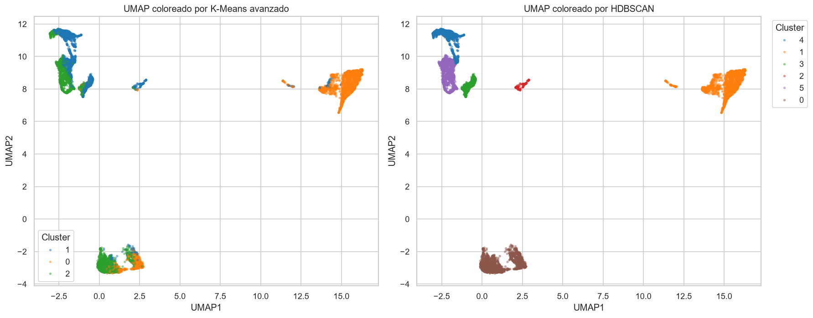

<strong>Figure 10.</strong> The same UMAP representation coloured by advanced K-Means and HDBSCAN assignments.

UMAP/HDBSCAN finds **6 clusters**, **0% noise**, and silhouette **0.727** within
the UMAP embedding. Its ARI against advanced K-Means is **0.347**, so the high
embedding-space separation describes an alternative representation rather than
automatic confirmation of the K-Means solution.

## Key analysis indicators

| Indicator | Value |
|---|---:|
| Customers analysed | 8,950 |
| Baseline variables | 17 |
| Selected baseline k | 3 |
| Components retaining at least 80% PCA variance | 7 |
| Variance retained by those components | 80.75% |
| Baseline K-Means silhouette | 0.251 |
| Baseline K-Means Calinski-Harabasz | 526.01 |
| Baseline K-Means Davies-Bouldin | 1.58 |
| Largest baseline segment | 68.37% |
| Advanced sub-sampling stability ARI | 0.933 ± 0.107 |

## Conclusions

The baseline analysis finds three understandable behavioural profiles: a large
low-activity group, intensive purchasers and customers characterised by high
cash-advance use. Median imputation preserved all observations, and scaling was
essential to stop monetary ranges from dominating distance-based models.
K-Means provided the strongest tested baseline combination of internal metrics
and interpretability.

The advanced representation changed cluster balance and membership
substantially. Its sub-sampling stability was strong, while UMAP/HDBSCAN exposed
a different six-cluster geometry rather than validating the same partition.
Isolation Forest contributes a review queue for unusual behaviour but no fraud
claim.

These results remain segmentation hypotheses, not ground truth. A genuine
temporal validation cannot be performed because the available dataset contains
six-month aggregates but no suitable date or repeated-period observations.

The full evidence is reproducible in
[`workshop-clustering-creditcard.ipynb`](https://github.com/Bootcamp-IA-MAD-P7/unsupervised-ml-workshop/blob/main/workshop-clustering-creditcard.ipynb)
and
[`workshop-clustering-creditcard-advanced.ipynb`](https://github.com/Bootcamp-IA-MAD-P7/unsupervised-ml-workshop/blob/main/workshop-clustering-creditcard-advanced.ipynb).
