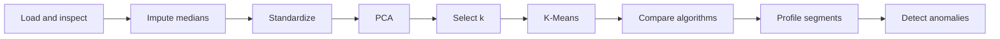

# Credit Card Customer Segmentation

Numerical clustering case study · 8,950 customers

This workshop segments cardholders from six months of aggregated behaviour.
Unlike the mushroom study, no reference class is available: model selection
therefore combines internal clustering metrics with the interpretability of the
resulting customer profiles.

> **Scope**
>
> The segments are an academic exercise. They are not credit-risk decisions,
> fraud labels or recommendations for automated customer treatment.

## Learning objective

The analysis demonstrates why numerical clustering requires explicit data
quality checks, scaling and careful validation. It also separates the
introductory workflow from optional advanced experiments:

- [`workshop-clustering-creditcard.ipynb`](https://github.com/Bootcamp-IA-MAD-P7/unsupervised-ml-workshop/blob/main/workshop-clustering-creditcard.ipynb):
  complete baseline workflow;
- [`workshop-clustering-creditcard-advanced.ipynb`](https://github.com/Bootcamp-IA-MAD-P7/unsupervised-ml-workshop/blob/main/workshop-clustering-creditcard-advanced.ipynb):
  KPI engineering, `log1p`, stability analysis and UMAP/HDBSCAN.

## Baseline workflow

The identifier is excluded from modelling. The single missing
`CREDIT_LIMIT` value and 313 missing `MINIMUM_PAYMENTS` values are imputed with
their medians because the monetary variables are strongly right-skewed.
Standardization prevents large monetary ranges from dominating distances.

PCA is used first to quantify retained variance and then as a two-dimensional
visual aid. Seven components retain 80.75% of the standardized variance; the
models themselves use the complete standardized feature space unless a section
explicitly states otherwise.

## Model selection

<strong>Figure 1.</strong> Inertia and sampled
silhouette across k=2–8. The executed maximum is k=3 with silhouette 0.238.

K-Means was selected with three clusters. On the common evaluation sample it
outperformed the tested agglomerative and Gaussian-mixture alternatives across
silhouette, Davies-Bouldin and Calinski-Harabasz. The result remains a moderate
geometric separation, so business interpretation is part of validation rather
than an afterthought.

DBSCAN on the PCA projection found one main dense region and labelled 681
customers (7.6%) as noise. This does not make those customers anomalous in a
business or fraud sense; it shows that the selected density configuration does
not provide a useful exhaustive segmentation.

## Customer profiles

<strong>Figure 2.</strong> Relative cluster means.
Red indicates above-average and blue below-average behaviour across the three
segments.

The profiles support three descriptive names:

| Segment | Main pattern | Possible analytical use |
|---|---|---|
| Low activity | Lower balances, purchases and limits | Activation and retention analysis |
| Intensive purchasers | Higher purchases, frequency, limits and payments | Loyalty and cross-selling analysis |
| Cash-advance users | Higher balances and cash advances; lower full-payment rate | Manual risk review and cost communication |

These names summarize averages. They are not permanent customer identities and
should be validated against profitability, arrears and fairness criteria before
operational use.

## Anomaly detection

<strong>Figure 3.</strong> Isolation Forest with a
declared 3% contamination assumption identifies 269 observations for review.

Isolation Forest prioritizes unusual combinations of behaviour. It does not
establish fraud, data error or premium status; each flagged case requires
contextual investigation.

## Advanced extension

The separate advanced notebook adds credit-utilization, average-transaction and
payment ratios, then compares the base representation with KPI and
KPI-plus-`log1p` variants.

- The advanced K-Means solution has mean sub-sampling stability ARI
  **0.933 ± 0.107**.
- UMAP/HDBSCAN finds **6 clusters**, no noise, and silhouette **0.727** in the
  UMAP embedding.
- Its ARI against advanced K-Means is **0.347**, so it is an alternative
  representation rather than an automatic replacement.

<strong>Figure 4.</strong> The same UMAP embedding
coloured by advanced K-Means and HDBSCAN assignments.

## Conclusions and limitations

- Scaling is essential for distance-based modelling on these mixed-range
  numerical variables.
- Three K-Means profiles provide the clearest baseline balance between internal
  quality and interpretability.
- Density and anomaly labels answer different questions from customer
  segmentation and must not be conflated.
- The file contains six-month aggregates but no date or period field. Genuine
  temporal validation requires comparable monthly snapshots.
- The dataset lacks profitability, arrears and demographic variables, so the
  business value and fairness of the segments remain untested.

