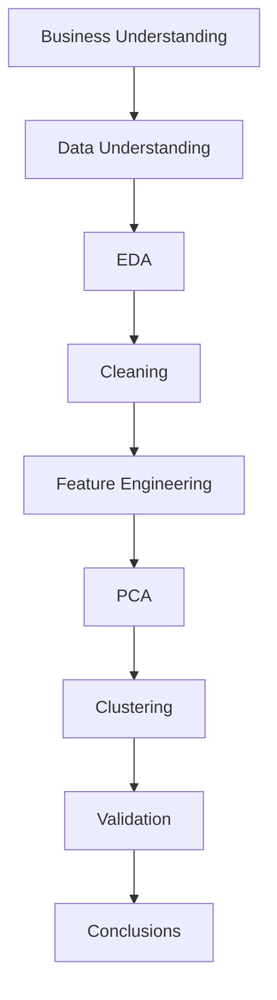

# Methodology

## Data Science Workflow

```mermaid
flowchart TD

A[Business Understanding]
B[Data Understanding]
C[EDA]
D[Cleaning]
E[Feature Engineering]
F[PCA]
G[Clustering]
H[Validation]
I[Conclusions]

A --> B
B --> C
C --> D
D --> E
E --> F
F --> G
G --> H
H --> I
```

## Documentation Principles

- Document important technical decisions.
- Keep commits small and meaningful.
- Maintain reproducible analyses.