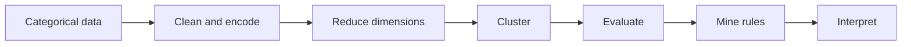
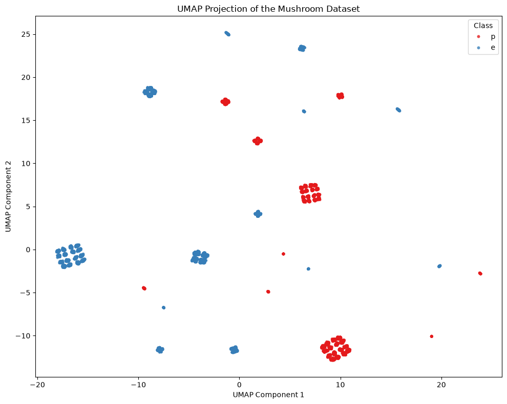
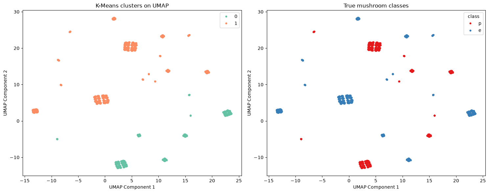
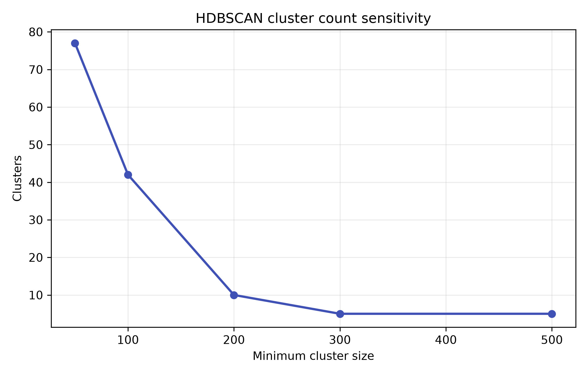
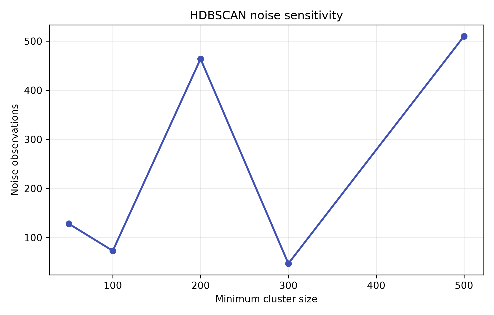
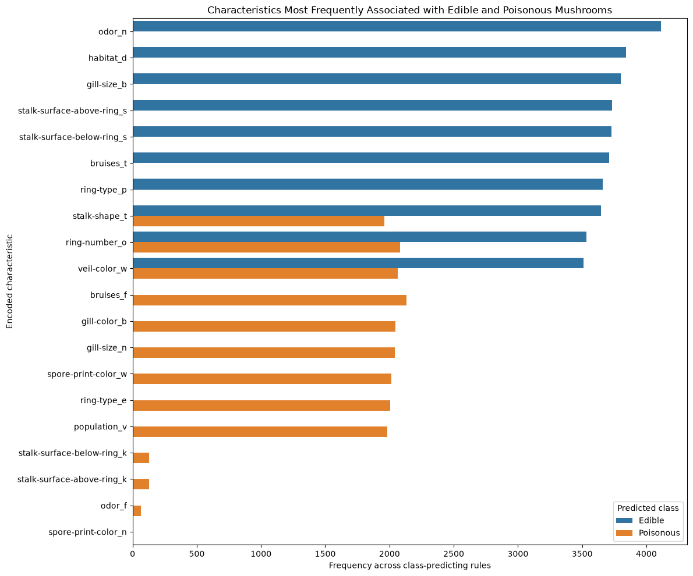
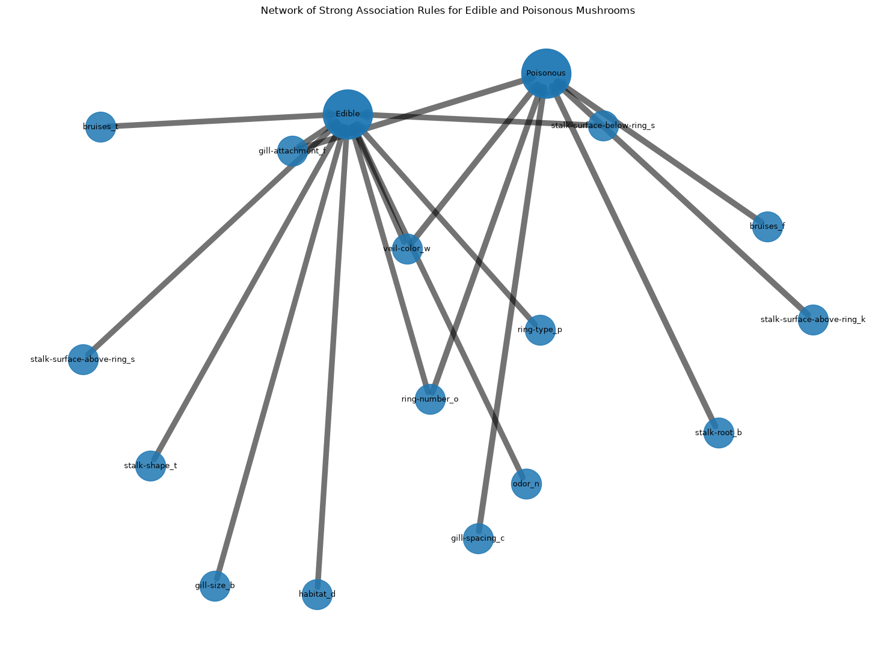

# Mushroom Workshop

Categorical representation · clustering · association rules

<strong>Project:</strong> Unsupervised Machine Learning Workshop 
<strong>Author:</strong> Gabriela Granja 
<strong>Repository:</strong> <a href="https://github.com/Bootcamp-IA-MAD-P7/unsupervised-ml-workshop">GitHub</a> 
<strong>Documentation:</strong> GitHub Pages

## Objective

This workshop asks how unsupervised techniques can represent, partition and
explain a categorical mushroom dataset. One-Hot Encoding makes the categories
usable by common algorithms, but produces a sparse, high-dimensional space in
which distance, density and two-dimensional visualisations must be interpreted
carefully.

The class label is withheld from clustering and used only afterwards to measure
agreement with the known edible/poisonous partition. It is also used as a
consequent during the separate association-rule stage.

## Dataset

| Item | Executed notebook result |
|---|---:|
| Observations | 8,124 |
| Original columns | 23: one class and 22 categorical predictors |
| Predictors after constant-column removal | 21 |
| One-Hot encoded features | 115 |
| Unknown `stalk-root` entries imputed | 2,480 |
| Reference classes | Edible and poisonous |

The `"?"` values in `stalk-root` are treated as missing and imputed with the
mode, category `b`. The constant `veil-type` column is removed before the class
column is separated and the remaining predictors are One-Hot encoded.

## Representation and dimensionality reduction

The baseline notebook uses PCA to reduce the 115 encoded indicators to ten
components for clustering and t-SNE for exploratory visualisation. The advanced
extension uses a two-dimensional UMAP embedding with `random_state=42` to
preserve local neighbourhood structure for visual inspection.

<strong>Figure 1.</strong> UMAP projection of all 8,124 observations. Reference classes colour the points only after the unsupervised embedding is fitted.

The compact islands show local organisation in the representation. They do not
prove that a clustering algorithm will reproduce the two reference classes:
UMAP compresses 115 dimensions into two and prioritises neighbourhoods rather
than class separation.

## Clustering

### Baseline progression

The ten-component PCA representation supports a two-cluster K-Means solution
with retrospective ARI **0.6171** and NMI **0.5663**. Agglomerative clustering
produces a similar result (ARI **0.6090**, NMI **0.5936**). DBSCAN finds several
groups, but its agreement changes with the distance definition: ARI **0.3736**
with Euclidean distance and **0.3236** with Jaccard distance.

These results established that representation and metric choices materially
change the partition, motivating the advanced UMAP and HDBSCAN experiments.

### K-Means on UMAP

<strong>Figure 2.</strong> Two K-Means clusters on the UMAP embedding (left) and the withheld reference classes (right).

K-Means on the two-dimensional UMAP coordinates records ARI **0.0116** and NMI
**0.0079**. The weak agreement is a useful negative result: visually distinct
UMAP islands do not combine into the same two groups as the human-defined class
label.

### HDBSCAN density structure

The baseline HDBSCAN configuration (`min_cluster_size=30`) identifies **92
clusters** and **24 noise observations**. Rather than forcing a binary split, it
captures many small density regions in the UMAP geometry.

<strong>Figure 3.</strong> Detected cluster count as `min_cluster_size` increases from 50 to 500.

<strong>Figure 4.</strong> Noise assignments for the same parameter sweep.

The cluster count falls from 77 to 5 across the tested settings, while noise
changes non-monotonically from 47 to 510 observations. This sensitivity means
the density partition is exploratory rather than a fixed answer.

## Algorithm comparison

| Representation and algorithm | Clusters | ARI | NMI | What it shows |
|---|---:|---:|---:|---|
| PCA(10) + K-Means | 2 | 0.6171 | 0.5663 | Strongest ARI in the baseline comparison |
| PCA(10) + agglomerative | 2 | 0.6090 | 0.5936 | Similar partition, slightly higher NMI |
| One-Hot + DBSCAN, Euclidean | 6 | 0.3736 | — | Multiple distance-defined groups |
| One-Hot + DBSCAN, Jaccard | 11 | 0.3236 | — | Partition changes with categorical distance |
| UMAP(2) + K-Means | 2 | 0.0116 | 0.0079 | Visual structure does not reproduce the labels |
| UMAP(2) + HDBSCAN | 92 + noise | — | — | Granular, parameter-sensitive density structure |

ARI and NMI compare clusters with labels retrospectively; they are not inputs
to model fitting. The table also compares different representations, so it
explains the evolution of the workshop rather than declaring a universal
winner.

## Association rules

Association rules are particularly useful here because they translate encoded
categories back into readable combinations. FP-Growth retains itemsets with
support at least **0.20**, and rules are generated with confidence at least
**0.90**.

- **Support** describes how often a combination occurs.
- **Confidence** describes how often its consequent occurs when the antecedent
  is present.
- **Lift** compares that confidence with the consequent's base rate.

The executed workflow generates 3,462,243 rules. After filtering to
class-predicting rules, 7,028 predict edible and 4,128 predict poisonous. The
compact selected rules have confidence **1.00** and lift **1.930608** for edible
or **2.074566** for poisonous consequents.

<strong>Figure 5.</strong> Characteristic frequencies across the class-predicting rule sets.

`odor_n` appears in 4,112 edible-predicting rules and none of the
poisonous-predicting rules in this output. Other characteristics occur on both
sides, demonstrating why frequency alone is not a sufficient discriminator.

<strong>Figure 6.</strong> A compact network from encoded characteristics to class consequents for ten selected rules per class; edge width follows lift.

The network makes overlapping combinations visible, but it is a co-occurrence
view—not a causal graph or identification guide.

## Advanced extension

The advanced notebook extends the baseline in three directions:

1. UMAP tests whether a nonlinear representation exposes local structure.
2. HDBSCAN explores that structure without fixing the number of clusters.
3. FP-Growth and association rules turn categorical co-occurrence into
   inspectable statements.

Together, the results show that geometry, partitions and readable rules answer
different questions. The most visually organised representation was not the
one with the strongest label agreement, while rule mining supplied the clearest
feature-level interpretation.

## Key findings

- Ten-component PCA with K-Means or agglomerative clustering produced moderate
  retrospective agreement with the two reference classes.
- UMAP revealed compact local regions, but K-Means on that embedding agreed
  weakly with the labels.
- HDBSCAN exposed granular density structure whose cluster and noise counts
  depended strongly on its parameters.
- Association rules were the most directly interpretable output, although the
  very large rule set required filtering and careful reading.

## Limitations

> **Safety notice**
>
> These results describe statistical associations in a curated dataset. They
> must not be used to identify mushrooms or decide whether a real mushroom is
> safe to consume.

- Two-dimensional PCA, t-SNE and UMAP views necessarily discard information.
- UMAP and HDBSCAN results depend on representation, environment and parameter
  choices despite fixed random states where applicable.
- One-Hot categories can be mutually exclusive or strongly correlated, and
  rule confidence does not imply causality.
- The findings have not been validated on an independent mushroom dataset.

## Conclusions

The workshop demonstrates that categorical unsupervised learning is primarily
a representation problem. PCA-based clustering recovered part of the known
binary structure, UMAP/HDBSCAN revealed finer local geometry, and association
rules produced the most readable combinations. None of these outputs is a
single ground truth: each reflects a different analytical objective and must be
interpreted with its assumptions visible.

The full evidence is reproducible in
[`workshop-clustering-Mushrooms.ipynb`](https://github.com/Bootcamp-IA-MAD-P7/unsupervised-ml-workshop/blob/main/workshop-clustering-Mushrooms.ipynb)
and
[`workshop-advanced-unsupervised.ipynb`](https://github.com/Bootcamp-IA-MAD-P7/unsupervised-ml-workshop/blob/main/workshop-advanced-unsupervised.ipynb).

