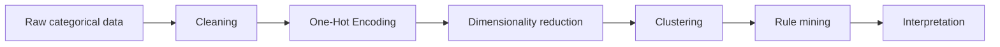

# Methodology

## Data and preprocessing

The local CSV contains 8,124 observations, one class column and 22 original
categorical predictors. The executed notebook performs the following operations:

1. Load `data/mushrooms.csv`.
2. Replace the 2,480 `"?"` entries in `stalk-root` with missing values.
3. Impute those values with the column mode, category `b`.
4. Remove `veil-type`, which has the single observed value `p`.
5. Separate `class` from the 21 remaining predictors.
6. Apply pandas One-Hot Encoding, producing 115 binary features.



## Dimensionality reduction

UMAP was fitted to all 115 encoded features with `n_components=2` and
`random_state=42`. Other UMAP parameters remained at the installed package
defaults. The output was an 8,124 × 2 embedding. Class labels were used only to
colour the resulting visualization.

## Centroid-based clustering

K-Means was fitted to the two-dimensional UMAP representation with
`n_clusters=2`, `n_init=10` and `random_state=42`. The resulting assignments
were compared retrospectively with the class labels.

## Density-based clustering

The baseline HDBSCAN model used `min_cluster_size=30` and
`prediction_data=True`; all other parameters remained at their defaults. A
sensitivity experiment then used `min_cluster_size` values 50, 100, 200, 300
and 500, setting `min_samples` to half of each value.

## Frequent patterns and association rules

The 115 encoded predictors were augmented with Boolean `class=e` and `class=p`
items. FP-Growth used `min_support=0.20` and `use_colnames=True`. Association
rules were then generated with confidence as the selection metric and
`min_threshold=0.90`. Class-specific analyses retained rules whose consequent
was exactly `class=e` or `class=p`. Compact network and Sankey views used the
top ten rules per class after limiting antecedents to at most three items and
sorting by confidence, lift and support.

Support is the fraction of observations containing the combined itemset.
Confidence is the fraction containing the consequent among observations that
contain the antecedent. Lift compares that confidence with the consequent's
overall prevalence; lift above one indicates more co-occurrence than expected
under independence.

## Retrospective validation

The **Adjusted Rand Index (ARI)** measures pairwise agreement between a cluster
partition and the reference classes while correcting for chance. The
**Normalized Mutual Information (NMI)** measures how much information the two
partitions share on a scale whose maximum is one. NMI, as used here, is not
adjusted for chance. Neither metric was used to train the models.

## Reproducibility

The website presents the study as a concise scientific narrative; it does not
duplicate the executable analysis page by page. The
[advanced notebook](https://github.com/Bootcamp-IA-MAD-P7/unsupervised-ml-workshop/blob/feat/advanced-unsupervised-techniques/workshop-advanced-unsupervised.ipynb)
contains the complete executable workflow and is the technical source of truth
for preprocessing, model configuration, computations and recorded outputs.

The static report figures can be regenerated from that executed evidence with:


```bash
python scripts/export_paper_figures.py
```

The export script validates canonical output strings, preserves embedded
notebook graphics, derives the HDBSCAN charts from executed sensitivity results
and writes the embedded Plotly Sankey to HTML. It avoids unnecessary reruns of
stochastic UMAP and the 3,462,243-rule generation.

The complete project context, notebook and dependency files are available in
the [repository](https://github.com/Bootcamp-IA-MAD-P7/unsupervised-ml-workshop).
