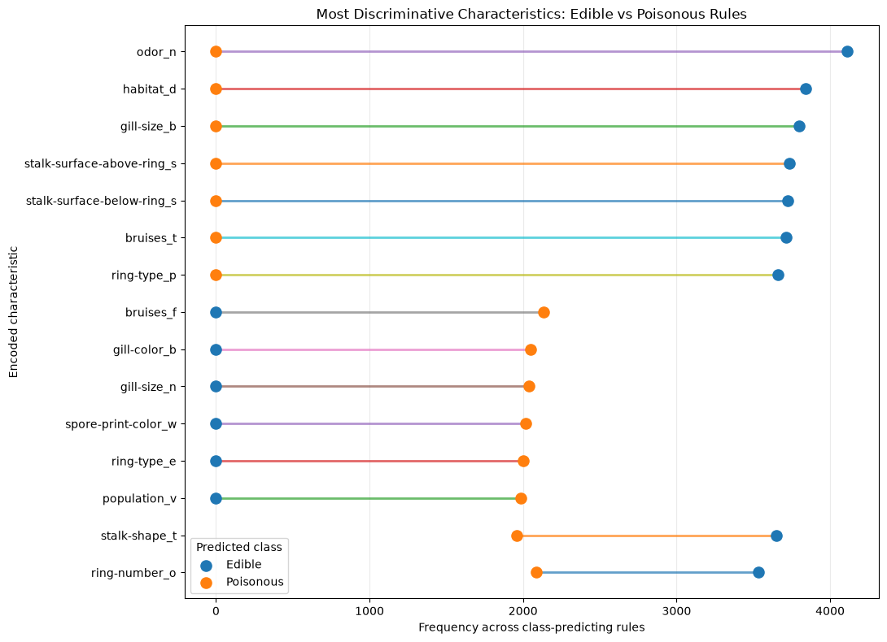
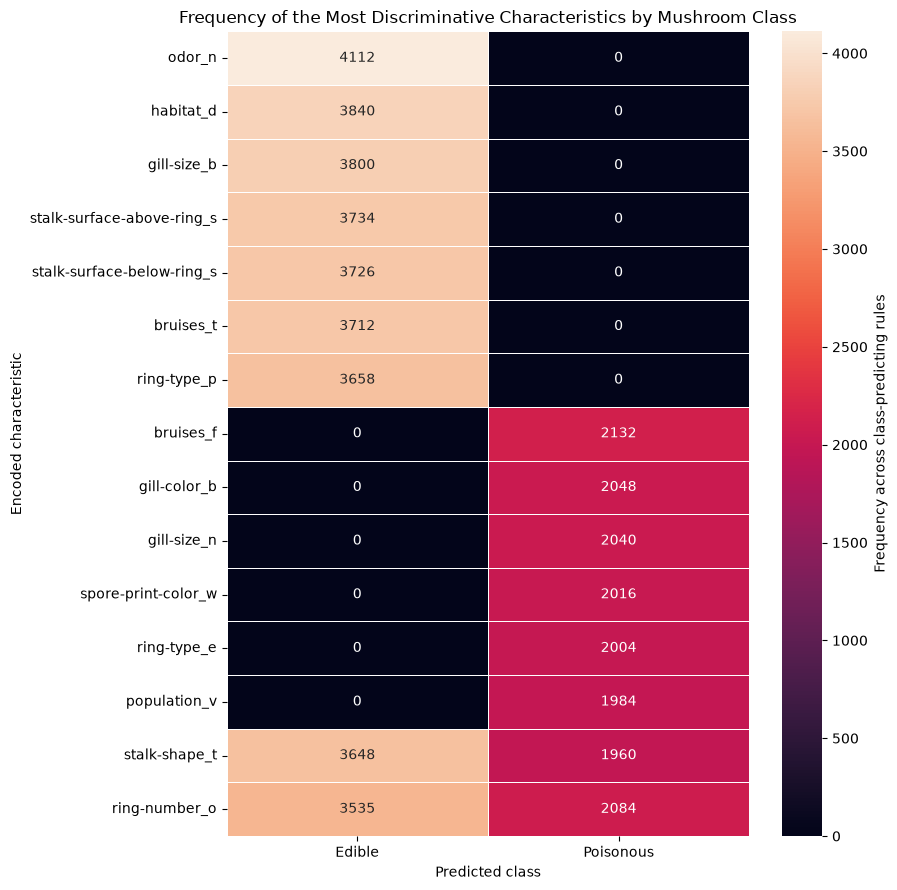

# Results

This page synthesizes the evidence needed to answer the research questions; it
does not reproduce the notebook's execution sequence. All numerical results
come from verified executed outputs. Labels are retrospective references, not
model inputs.

## Principal results

| Analysis | Verified result |
|---|---:|
| Observations × encoded features | 8,124 × 115 |
| K-Means on UMAP — ARI | 0.0636 |
| K-Means on UMAP — NMI | 0.0465 |
| Baseline HDBSCAN (`min_cluster_size=30`) | 87 clusters; 31 noise points |
| Association rules generated | 3,462,243 |
| Rules predicting edible / poisonous | 7,028 / 4,128 |
| Compact selected rules | 10 per class |
| Compact-rule confidence | 1.00 |
| Compact-rule lift, edible / poisonous | 1.930608 / 2.074566 |

## UMAP representation

<strong>Figure 1.</strong> Two-dimensional UMAP projection of 115 One-Hot encoded features. Colours show reference classes only after fitting.

**Finding.** The embedding contains multiple compact local regions rather than
only two continuous groups. Visual organization is evidence about the
low-dimensional representation, not by itself evidence of clustering quality.

## K-Means versus reference labels

<strong>Figure 2.</strong> K-Means assignments on the UMAP embedding (left) compared with retrospective class labels (right).

**Finding.** The two-cluster solution achieved ARI 0.0636 and NMI 0.0465. The
weak agreement shows that a visually structured embedding did not make the
centroid partition equivalent to the dataset's edible/poisonous labels.

## HDBSCAN sensitivity

| `min_cluster_size` | `min_samples` | Clusters | Noise observations |
|---:|---:|---:|---:|
| 50 | 25 | 75 | 6 |
| 100 | 50 | 28 | 341 |
| 200 | 100 | 10 | 524 |
| 300 | 150 | 6 | 236 |
| 500 | 250 | 6 | 844 |

<strong>Figure 3.</strong> Number of non-noise HDBSCAN clusters as the minimum cluster size increases.

**Finding.** The number of detected clusters fell sharply from 75 to 6 across
the tested settings, confirming that the granular density partition is highly
parameter-sensitive.

<strong>Figure 4.</strong> Observations assigned the HDBSCAN noise label at each tested setting.

**Finding.** Noise generally increased as the density requirement became more
restrictive, reaching 844 at the largest setting. The sequence was not
monotonic—236 points were labelled noise at 300—so it should not be summarized
as a simple linear relationship.

## Association-rule feature patterns

<strong>Figure 5.</strong> Encoded-characteristic frequencies across the 7,028 edible-predicting and 4,128 poisonous-predicting rules.

**Finding.** `odor_n` occurred in 4,112 edible-predicting rules and no
poisonous-predicting rules in this rule set. Several common encoded
characteristics occurred frequently for both classes, so frequency alone is not
equivalent to discrimination.

## Class-specific characteristics

<strong>Figure 6.</strong> Frequency gaps for the 15 most discriminative encoded characteristics.

**Finding.** The largest edible-side contrasts included `odor_n`, `habitat_d`,
`gill-size_b`, smooth stalk-surface indicators, `bruises_t` and `ring-type_p`.
Poisonous-side contrasts included `bruises_f`, `gill-color_b`, `gill-size_n`,
`spore-print-color_w`, `ring-type_e` and `population_v`.

<strong>Figure 7.</strong> Compact heatmap of the same high-contrast rule frequencies by class.

**Finding.** The heatmap separates class-concentrated indicators from shared
high-frequency indicators such as `stalk-shape_t` and `ring-number_o`. Shared
frequency does not make either characteristic a sufficient standalone
discriminator.

## Association structure

<strong>Figure 8.</strong> Directed network from encoded characteristics to class consequents for ten selected rules per class. Edge width follows rule lift in the executed plotting code.

**Finding.** The selected associations form overlapping feature-to-class
connections. The network communicates connectivity only; it is not a causal
graph and does not establish biological importance.

An [interactive Sankey diagram](../figures/association_sankey.html) supplements
Figure 8. Its flow width represents accumulated support across the selected
rules, not causal influence.
